# PySOMVis framework

**PySOMVis framework** involves popular Self-Organizing Maps visualization techniques, which is inspired by Java based **SOMToolbox** (http://www.ifs.tuwien.ac.at/dm/somtoolbox/index.html)
# Current visualizations 
Pictures bellow are based on the projected Chain Link Data set (http://ifs.tuwien.ac.at/dm/somtoolbox/datasets.html). It is synthetic data representing two intertwined rings, which presents the topology violations after projection.
  The SOM map represents **18x12 neurons** trained **10000 times** with learning rate **0.7** and sigma **7** in **SOMToolbox**.

<table align="center">
<tbody align="center">
  <tr align="center">
    <td align="center">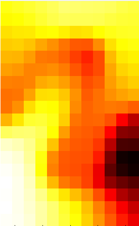 Activity Histogram</td>
    <td align="center">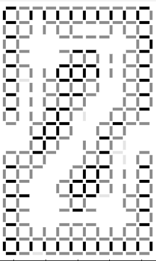 Cluster Connection</td>
    <td align="center">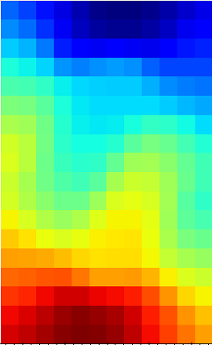 Component Plane</td>
    <td align="center">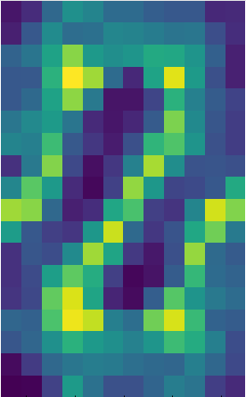 D-Matrix</td>
    <td align="center">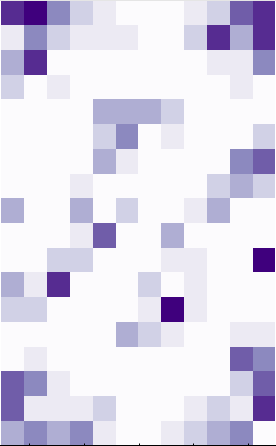 Topology Error</td>
    <td align="center">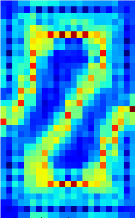 U-Matrix</td>
  </tr>
  <tr align="center">
    <td align="center">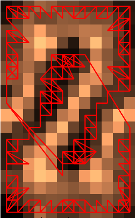 Graph based</td>
    <td align="center">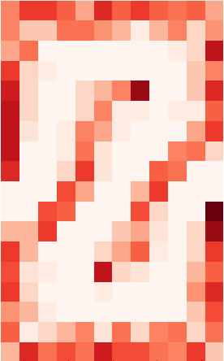 Hit Histogram</td>
    <td align="center">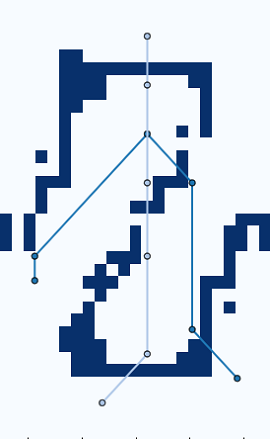 Metro Map</td>
    <td align="center">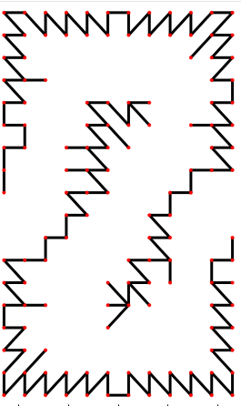 Minimum Spanning Tree</td>
    <td align="center">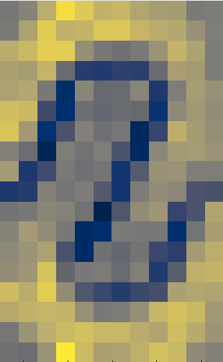 U*-Matrix</td>
    <td align="center">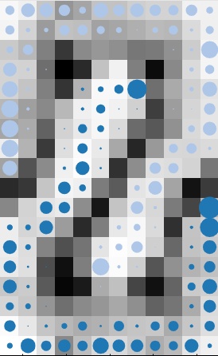 Pie Chart</td>
  </tr>
  <tr align="center">
    <td align="center">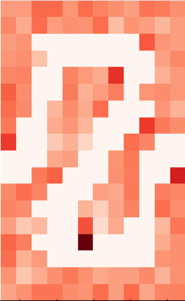 Quantization Error</td>
    <td align="center">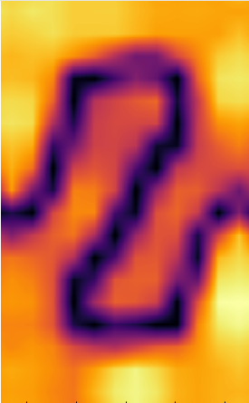 Smoothed Data Histogram</td>
    <td align="center">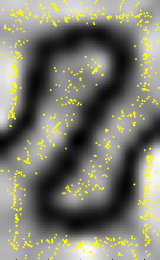 Sky Metaphor</td>
    <td align="center">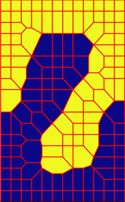 Chessboard</td>
    <td align="center"> K-means (2 clusters)</td>
    <td align="center"> average, complete, single, WARD</td>
  </tr>
</tbody>
</table>
 

# SOMStreamVis approach
SOMStreamVis approach helps to explore dynamic pattern with trained map. The example represents weather forecast, it includes **5 features** of different temperature, pressure and wind speed values over **35 years** (taken from the https://power.larc.nasa.gov/data-access-viewer/). 
The features are following:
<ul>
  <li>RH2M - Relative Humidity at 2 Meters (%)</li>
  <li>PS - Surface Pressure (kPa)</li>
  <li>T2M - Temperature at 2 Meters (C)</li>
  <li>WS50M - Wind Speed at 50 Meters (m/s)</li>
  <li>ALLSKY_SFC8_LW_DWN - Downward Thermal Infrared (Longwave) Radiative Flux (kW-hr/m^2/day)</li>
  </ul>
Dynamic exploration with SOMStreamVis:

<table align="center">
<tbody align="center">
  <tr align="center">
    <td align="center">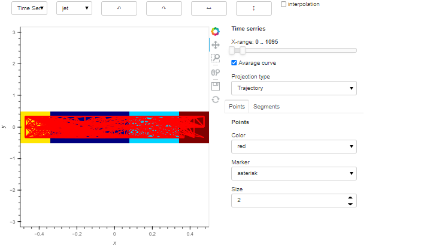 SOMStreamVis interface with trajectory-based approach</td>
    <td align="center">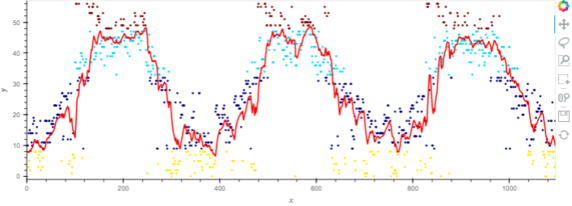 Projection of 3 years (coloring is based on WARD clusterisation) 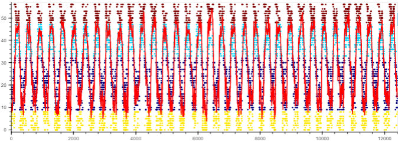 Projection of 35 years (coloring is based on WARD clusterisation)</td>
  </tr>
</tbody>
</table>

# Citation
1. Sergei Mnishko and Andreas Rauber. Som visualization framework in python, including somstreamvis, a time series visualization. In Jan Faigl, Madalina Olteanu, and Jan Drchal, editors, Advances in Self-Organizing Maps, Learning Vector Quantization, Clustering and Data Visualization, pages 98–107, Cham, 2022. Springer International Publishing. DOI: https://doi.org/10.1007/978-3-031-15444-7_10
