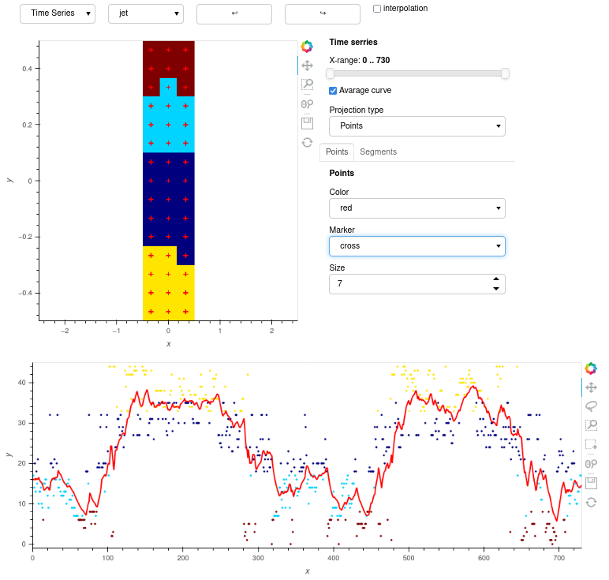

# PySOMVis

This repository contains the result of Master Thesis paper in Technical University of Vienna. It envolvs popular Self-Organizing maps visualization techniques, which were taken from Java based SOMToolbox (http://www.ifs.tuwien.ac.at/dm/somtoolbox/index.html) and additional one which tries to follow the changes in Time Serries data set. 
The picture bellow (timeseries.ipynb) represents visualiztion algorithm on weather forecast data. The data set includes 5 fetures of different temperature, pressure and wind speed values over 35 years (taken from the https://power.larc.nasa.gov/data-access-viewer/). The features are following:
<ul>
  <li>RH2M - Relative Humidity at 2 Meters (%)</li>
  <li>PS - Surface Pressure (kPa)</li>
  <li>T2M - Temperature at 2 Meters (C)</li>
  <li>WS50M - Wind Speed at 50 Meters (m/s)</li>
  <li>ALLSKY_SFC8_LW_DWN - Downward Thermal Infrared (Longwave) Radiative Flux (kW-hr/m^2/day)</li>
  </ul>
 Here we can observ the 1 year forecast projection
 
/brThe following plot represents projection over all dataset. /br

 
 
